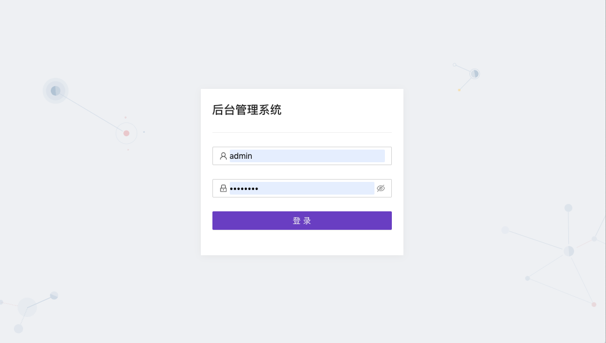

# react开发脚手架二次开发后台管理系统模板
#### 简介： React 16.x、Ant Design 4.x、国际化、router、redux、ui仿antd-admin-pro、动态路由、动态菜单权限、页面状态缓存
## 作者： 月下独奏
### [更新日志](./note/updatelog.md)
##### 个人认为舒服的cli会提升开发的幸福度，所以部分习惯参考了vue-cli
##### 如果喜欢vue建议参考项目:[woleicom/vue-admin-template](https://github.com/woleicom/vue-admin-template)
##### 如果喜欢vue建议直接选择vue element admin,已经做得很好了，不需要在二次开发了
-----------
### 感谢：
- [React 16](https://reactjs.org/)
- [Ant Design 4](https://ant.design/)
-----------
### 优化内容（所有依赖库基于2020年第一季度最新包版本）
- 用rescripts库重写create-react-app cli的webpack配置部分(配置更方便，可读性更好)
- .rescripts配置rescripts配置
- .eslintrc配置eslint规则(文件中已备注可以忽略eslint校验规则的备注，打开注释即可忽略校验)
- .babelrc配置babel配置
- .postcssrc.js配置postcss配置
- .browserslistrc配置浏览器支持
- .env.*配置不同--mode模式下的环境变量
- 增加webpack编译打包进度条
- 增加@指向src目录快捷访问文件夹和文件
- 增加webpack end 插件，自动压缩打包文件并命名项目名称和打包日期时间
- 集成antd并可自定义theme
- UI参考antd admin pro(并不太喜欢antd admin pro脚手架，但是样式没得说，很漂亮)
- 集成react-router,并根据角色自动配置菜单和路由权限（权限在api中前端设置的测试数据）
- 导航面包屑根据用户菜单自动获取，不在放到页面手动配置。
- 集成redux(因为刚接触react不到一个月，redux还不是很上手，redux跟hooks的useReducer可能规整不是很好，导致只判断了userInfo.id不存在就跳转到登录页面)
- 增加utils/pageState缓存页面状态全局变量工具，没有存储storage，刷新无效
- 集成i18n国际化（使用react-intl集成国际化，导航头切换语言，首页查看效果）

### 开发中兼容性(IE兼容在单独IE分支，不在维护)
- 兼容IE10、11默认关闭（通过注释src/index.js、.babelrc、.browserslistrc配置）
- 兼容到IE11（通过babel兼容）
- 兼容到IE10（pulic/index.html注释需要打开，因为在开发过程中create-react-app引入了一个只针对node环境的颜料库，导致在IE10中缺少相关函数对象，需要在全局静态配置polyfill，而在src中引入无效，如果只需要生产环境支持，则不需要，打包后会自动过滤掉，html中也根据是否development进行判断了）
### 相关命令
```
//启动前台服务
npm run start
//打包staging环境
npm run build:stag
//打包正式环境
npm run build
```
-------------
### 展示

